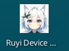
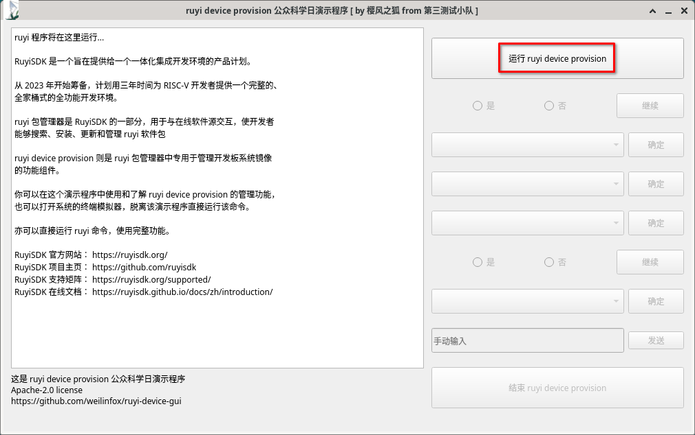
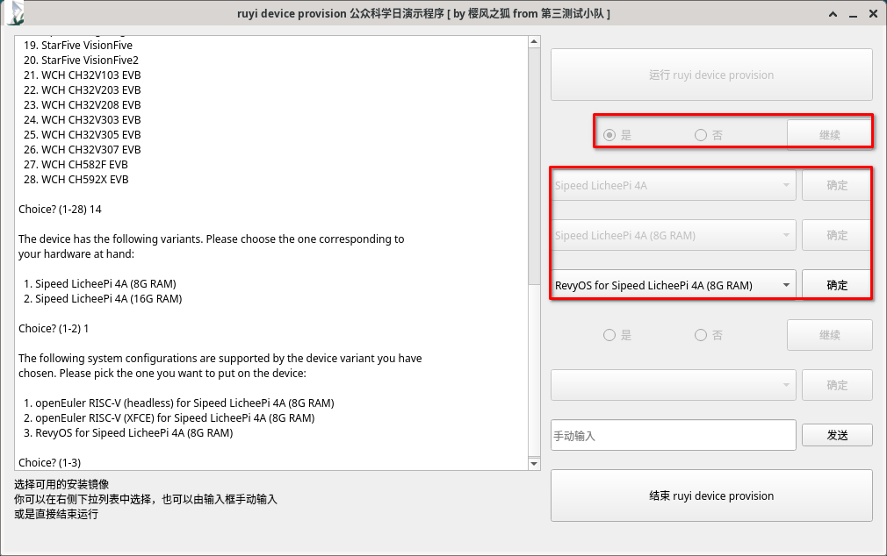
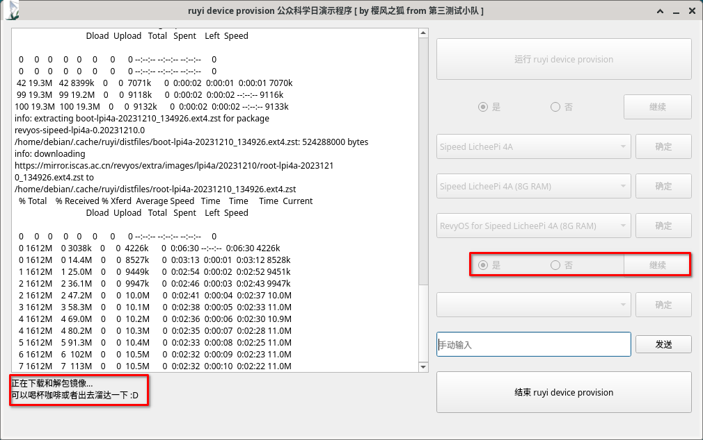
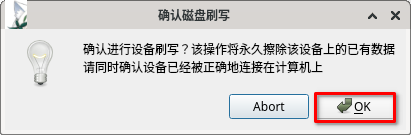
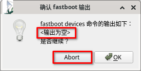
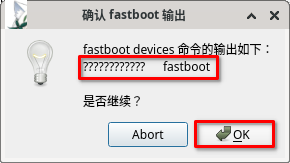
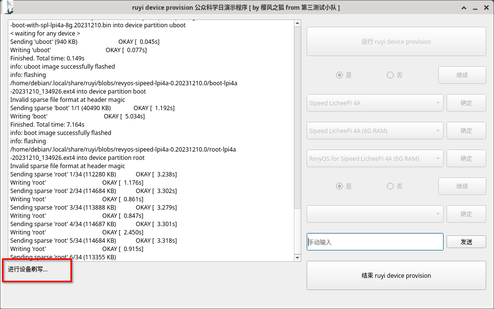
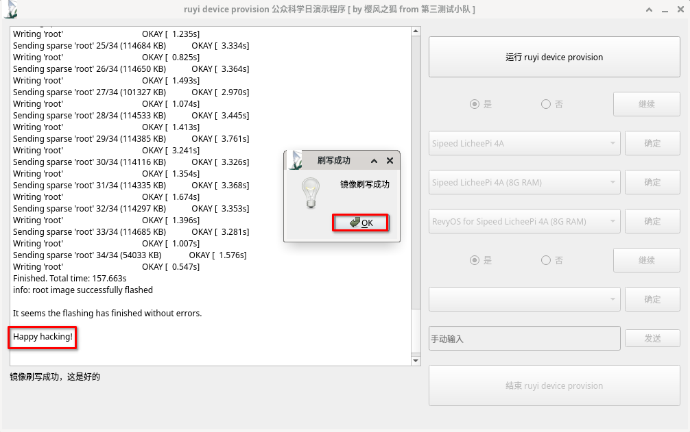

# ruyi device provision 交互式活动

ruyi device provision 是 Ruyi 包管理器中专用于提供开发板固件/软件更新或硬件资料说明功能组件。

由于 RISC-V 板卡众多，用户购买板卡后往往需要到对应厂家网站寻找可用的板卡镜像，或到第三方适配的厂家寻找适配的镜像。
这些镜像分布在互联网的各个角落，寻找费时费力。找到资源后还需要手动对镜像进行解包和刷写。

而 ruyi 的镜像刷写功能则集合了各种板卡的各种镜像，用户只需要选择对应的板卡和想要安装的系统，
剩下的就交给 ruyi device provision 吧。

由于 ruyi device provision 当前还是一个纯英文命令行程序，这里提供了一个演示性的中文 GUI 向导作为指引，
协助用户完成整个镜像刷写过程。

## 荔枝派 4A 8G 版本 RevyOS 刷写

这里以荔枝派 4A 8G 版本为例，对它进行 RevyOS 的刷写。

### 准备工作

+ 一条 USB Type-C 线缆
+ 一块荔枝派 4A 8G 版本
+ 一部显示器
+ ruyi device provision 演示程序

### 开始

双击桌面图标，即可进入到演示程序。

左边是一个虚拟终端，由于 ruyi 是一个命令行工具，所以之后 ruyi 将在这个虚拟终端中运行。

ruyi 会给出一些提示，注意 ruyi 本身是在普通用户环境下运行的，有些镜像的则刷写需要使用 sudo 提权。
该演示环境做了一些配置，普通用户无需提权也能进行刷写操作。

下面来到镜像选择阶段，由于这里刷写荔枝派 4A 的 8G 版本，依次选择荔枝派 4A、 8G 版本，再选择 RevyOS。

ruyi 会提示现在需要下载镜像，选择“是”就会开始下载。当前演示环境可能是一个没有网络的环境，故镜像是预先下载好的。
 ruyi 会自动使用缓存的镜像，而不是重复下载。

镜像下载和解包完成后，会提示确认设备刷写。

这时需要将荔枝派 4A 通过 Type-C 线缆连接到计算机上。
具体的步骤是按住荔枝派 4A 上的 boot 按钮，同时将荔枝派 4A 插在计算机上。

下一步会确认 fastboot 的输出。

如果显示输出为空，则说明荔枝派 4A 没有被正确连接，请中断操作，并重新开始上面的步骤。

如果输出如上图所示，则说明连接一切正常，继续后面的操作。

开始设备刷写。

等待一会，就会刷写成功。

拔下荔枝派 4A，将 HDMI 接口与显示器连接， Type-C 线缆与电源适配器连接。

荔枝派 4A 应当能够正常启动，并进入到桌面。

默认用户名为 ``debian``，密码为 ``debian``。
