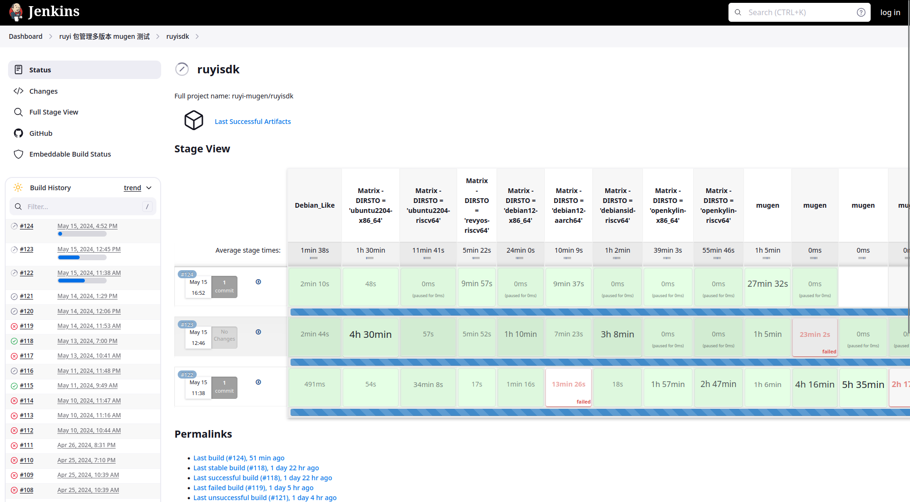

# ruyi 包管理测试介绍文字

Ruyi 包管理测试平台是 Ruyi 包管理主要的质量验证平台，由 Jenkins CI 管理整个测试流程，直接生成测试报告。

该测试保证 Ruyi 包管理器每个版本发布的 x86-64、 riscv64 和 arm64 三种架构二进制以及 Ruyi Repo 中的二进制包，
都能够在 Debian、 Ubuntu、 Fedora、 Archlinux、 Gentoo、 RevyOS、 openEuler、openKylin 等国内外知名发行版正常运行。

Ruyi 包管理器每个版本都会发布一系列测试报告，针对包管理器本身会发布 20 个环境的测试报告：

+ x86_64 Debian 12 QEMU
+ x86_64 Fedora 38 QEMU
+ x86_64 Ubuntu 22.04 LTS QEMU
+ x86_64 openEuler 23.09 QEMU
+ x86_64 Archlinux Container
+ x86_64 Gentoo QEMU
+ x86_64 openKylin 1.0.2 QEMU
+ riscv64 Debian sid Container
+ riscv64 Fedora 38 QEMU
+ riscv64 Fedora 38 Pioneer Box
+ riscv64 Ubuntu 22.04 LTS QEMU
+ riscv64 RevyOS Container
+ riscv64 RevyOS LicheePi4A
+ riscv64 openEuler 23.09 QEMU
+ riscv64 openEuler 23.09 LicheePi4A
+ riscv64 openEuler 23.09 Pioneer Box
+ riscv64 Archlinux Container
+ riscv64 Gentoo QEMU
+ riscv64 openKylin 1.0.1 QEMU
+ aarch64 Debian 12 QEMU

随着测试平台的完善，测试环境的数量也在稳定增加中。
