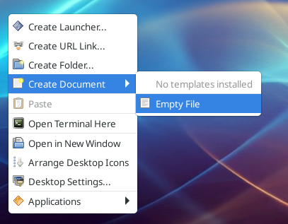
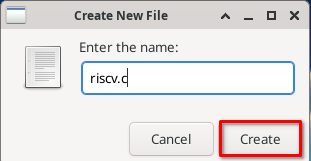
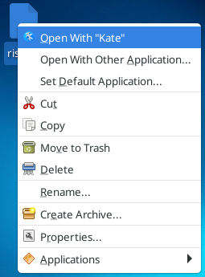
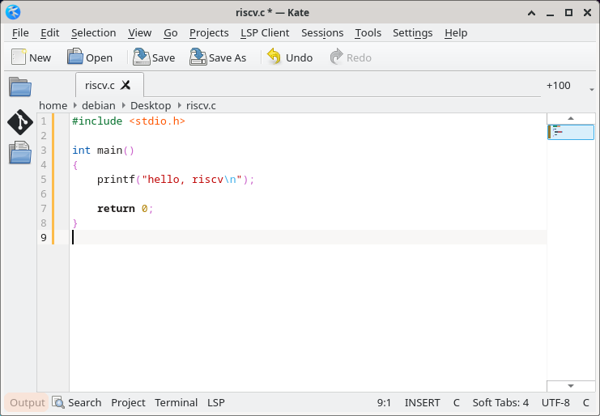
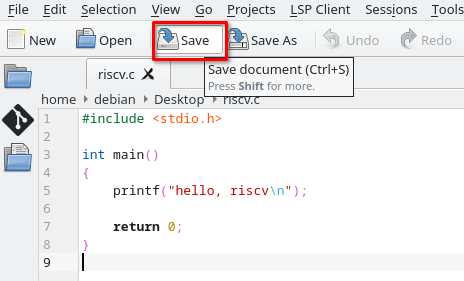
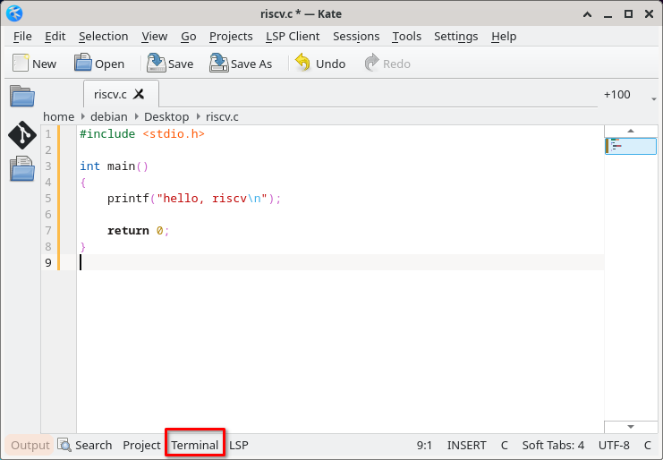
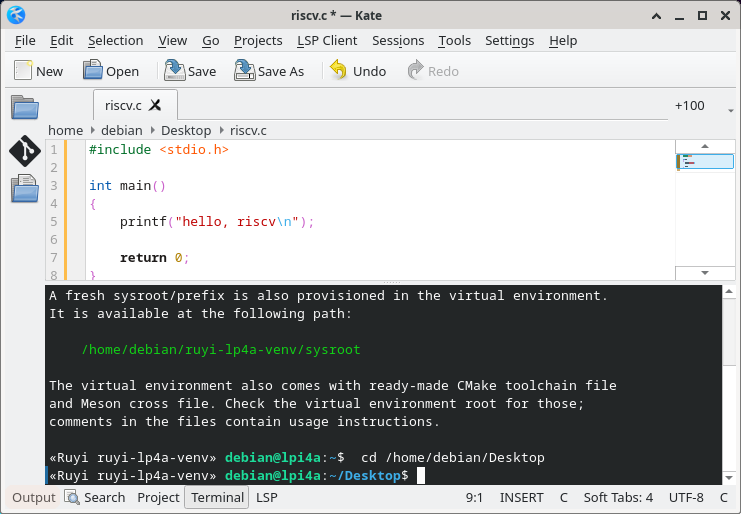
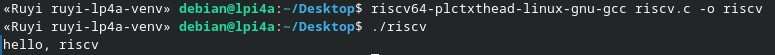

# ruyi 包管理器交互式活动

Ruyi 包管理器是 RuyiSDK 中负责管理 RuyiSDK 各种软件源的工具，用于管理工具链、模拟器、源码等各种二进制软件包和源码包。

同时 Ruyi 包管理器具备根据开发者目标开发板管理对应的工具链并建立编译环境的功能。

以荔枝派 4A 为例：

```bash
$ ruyi install gnu-plct-xthead
$ ruyi venv -t gnu-plct-xthead sipeed-lpi4a ruyi-lp4a-venv
$ . ruyi-lp4a-venv/bin/ruyi-activate
```

其中 gnu-plct-xthead 是荔枝派 4A 对应的工具链， sipeed-lpi4a 是 Ruyi 包管理器为荔枝派 4A 预置的配置。

ruyi 的 venv 功能在使用上和 python 的 venv 非常类似。在上述代码中，它在 ruyi-lp4a-venv 建立一个编译环境配置，并生成 ruyi-activate 脚本供激活该编译环境。

在本演示环境中，已经利用 ``.bashrc`` 自动化了这一过程，打开终端后会自动建立和进入编译环境。

## 在荔枝派 4A 上进行 RISC-V 程序开发

登陆桌面用户名 debian，默认密码 debian。

在桌面新建源代码文件 riscv.c。





使用 kate 打开该源码文件。



编写源码，这里是一个简单的 C 语言程序，其功能是打印一行“hello, riscv”的内容。

```c
#include <stdio.h>

int main()
{
    printf("hello, riscv\n");

    return 0;
}
```



保存源码。



打开 terminal。



此时需要等待一下，将自动建立编译环境。



在终端中键入两行命令：

```bash
gcc riscv.c -o riscv
./riscv
```

可以看到成功打印出 “hello, riscv” 字样。



注意这里的 gcc 实际上调用的是 riscv64-plctxthead-linux-gnu-gcc，这是通过 alias 实现的。

如果编译失败，请检查源代码文件。

一个正确的源码文件会自动生成为桌面或家目录下的 answer.txt 文件，或查看桌面或家目录下的 demo.c 文件（如果它还在）。
