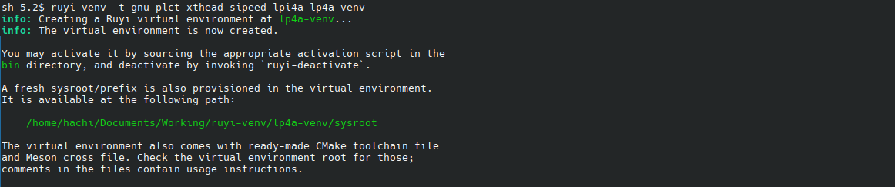

# ruyi 包管理器交互式活动

## 在荔枝派 4A 上进行 RISC-V 程序开发

安装荔枝派 4A 工具链

```bash
$ ruyi install gnu-plct-xthead
```


建立编译环境

```bash
$ ruyi venv -t gnu-plct-xthead sipeed-lpi4a lp4a-venv
```



进入编译环境

```bash
$ . lp4a-venv/bin/ruyi-activate
```


编写源码 hello-riscv.c

```bash
$ nano hello-riscv.c
```


编写完成后按 Ctrl+o 回车保存；再按 Ctrl+x 退出

构建源码

```bash
$ riscv64-plctxthead-linux-gnu-gcc hello-riscv.c -o hello-riscv
```


运行

```bash
$ ./hello-riscv
```


退出编译环境

```bash
$ ruyi-deactivate
```


清理工作区

```bash
$ rm -r hello-riscv hello-riscv.c lp4a-venv
```
