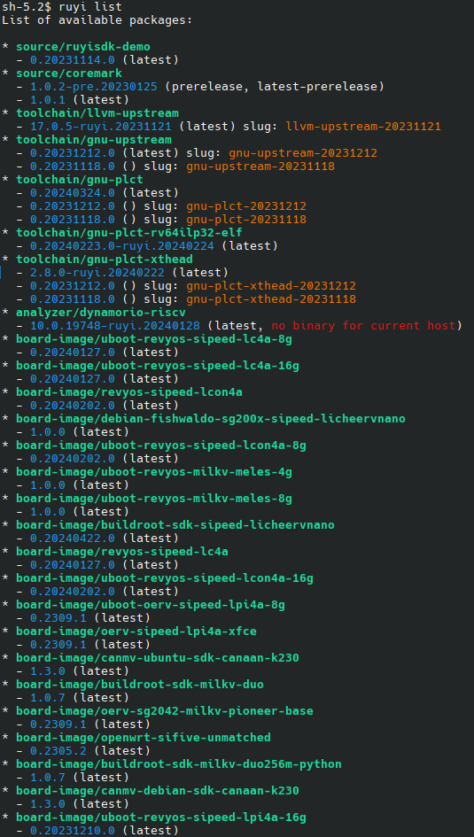
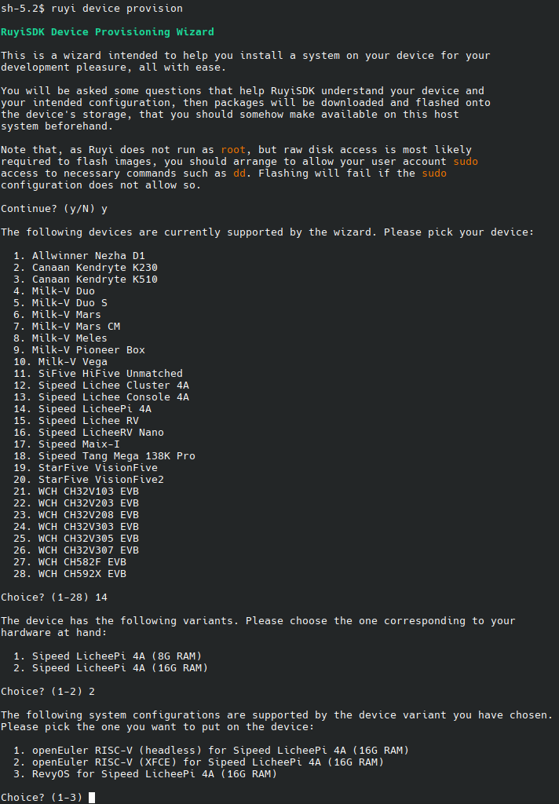

# ruyi 介绍文字

RuyiSDK 是一个旨在提供给一个一体化集成开发环境的产品计划。从 2023 年开始筹备，计划用三年时间为 RISC-V 开发者提供一个完整的、全家桶式的全功能开发环境。

## RuyiSDK 的目标

1. 开发者购买了 (几乎) 任何一款 RISC-V 开发板或模组，都可以通过 RuyiSDK 系统获得硬件资料说明、固件 / 软件更新、调试支持等。
2. 开发者可以指定任何常用的 RISC-V 扩展指令集架构组合，都可以通过 RuyiSDK 系统生成客户所需的操作系统、工具链、语言执行环境 (运行时或虚拟机)、计算库、应用框架等。尤其强调 RuyiSDK 将完全支持 Vector 0.7.1 和 RVP 0.5.2 等已经大规模硅化的草案 标准 (or 厂商定制扩展)。
3. 培育运营一个活跃全面的开发者交流社区。

RuyiSDK 官方网站： https://ruyisdk.org/
RuyiSDK 项目主页： https://github.com/ruyisdk
RuyiSDK 支持矩阵： https://ruyisdk.org/supported/
RuyiSDK 在线文档： https://ruyisdk.github.io/docs/zh/introduction/

## RuyiSDK 的组成

RuyiSDK 主要包含了一个组件管理器（也称为包管理器，Ruyi Repo）、一个集成开发环境（Ruyi IDE）、一个开发者交流社区；

想象一下，你要做一款能够运行在RISC-V设备上的应用程序，比如用C或者C++语言开发一个图像识别的程序，Ruyi IDE 就像是一个你的工作室，里面有各种各样的工具可以帮助你完成这个任务。首先创建项目，从RuyiSDK包管理器中下载和安装所需的编译工具链、调试工具、模拟器等工具，然后在文本编辑器中完成对代码的编辑，接着对项目进行编译构建获得RISC-V架构的可执行程序，最后在模拟器或者RISC-V开发板上进行运行和测试。如果代码需要调试，也可通过调试工具进行代码调试。这一过程和x86下的开发、编译构建、调试、运行的流程是一致的，只是适用于当前开发语言及目标运行设备的RISC-V的编译工具链、模拟器等软件和工具都可以从Ruyi Repo中获取，在安装和IDE初始设置时都已经被集成到 Ruyi IDE 之中，用户无需为环境搭建耗费精力。

## Ruyi 包管理器

Ruyi 包管理是 RuyiSDK中负责管理RuyiSDK各种软件源的工具，用于管理工具链、模拟器、源码等各种二进制软件包和源码包。

Ruyi 包管理器已经具备了在命令行下进行 RISC-V 架构软件开发调试以及对多达 28 种 RISC-V 开发板提供固件软件更新或硬件资料说明的能力。

